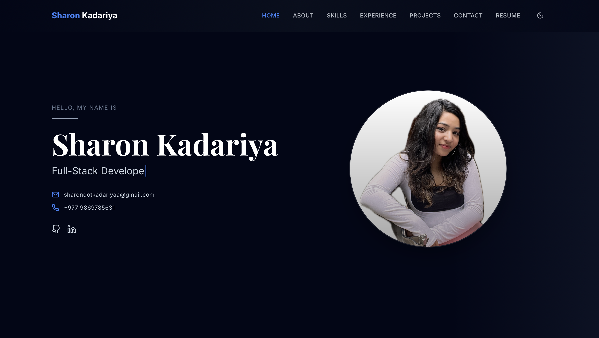

# Sharon Kadariya - Portfolio

[](https://reactjs.org/)
[](https://vitejs.dev/)
[](https://tailwindcss.com/)

A modern, responsive portfolio website built with **React**, **Vite**, and **Tailwind CSS**.

🌐 **Live Demo**: [www.sharonkadariya.com.np](https://www.sharonkadariya.com.np)



---

## Features

- Responsive design for all devices
- Smooth animations with Framer Motion
- Typewriter effect in hero section
- Particle background animation
- Contact section with social links

## Tech Stack

- [React 18](https://reactjs.org/) - UI Library
- [Vite](https://vitejs.dev/) - Build Tool
- [Tailwind CSS](https://tailwindcss.com/) - Styling
- [Framer Motion](https://www.framer.com/motion/) - Animations

## Project Structure

```
src/
├── components/     # React components
│   ├── Header.jsx
│   ├── Hero.jsx
│   ├── About.jsx
│   ├── Experience.jsx
│   ├── Skills.jsx
│   ├── Projects.jsx
│   └── Contact.jsx
├── data/          # Projects & skills data
├── hooks/         # Custom hooks
└── App.jsx        # Main app
```

## Development

```bash
# Install dependencies
npm install

# Start dev server
npm run dev

# Build for production
npm run build
```

## Contact

-  Email: [sharonkadariya@gmail.com](mailto:sharonkadariya@gmail.com)
- 💼 LinkedIn: [Sharon Kadariya](https://www.linkedin.com/in/sharon-kadariya-9009851b5/)
- 🐙 GitHub: [@GitSharon3](https://github.com/GitSharon3)

---

Built with ❤️ by Sharon Kadariya
